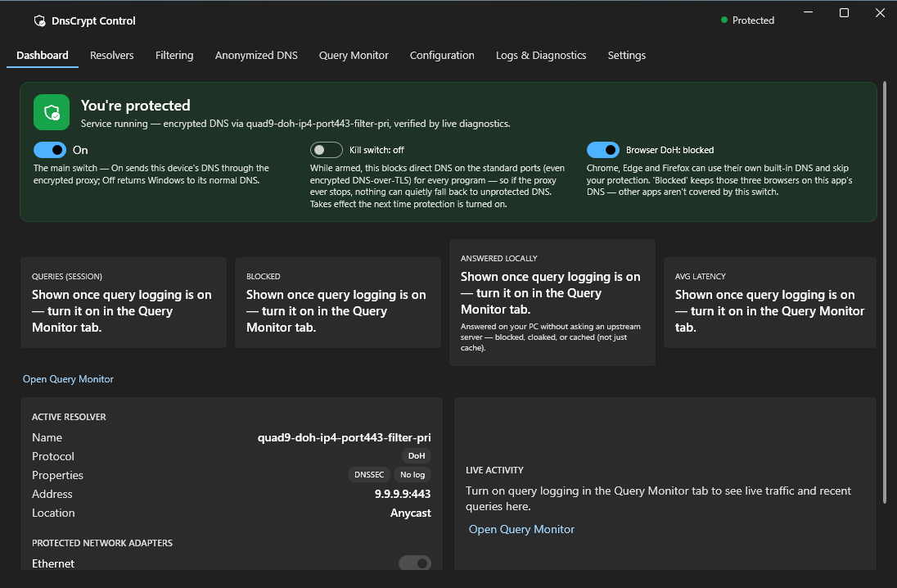
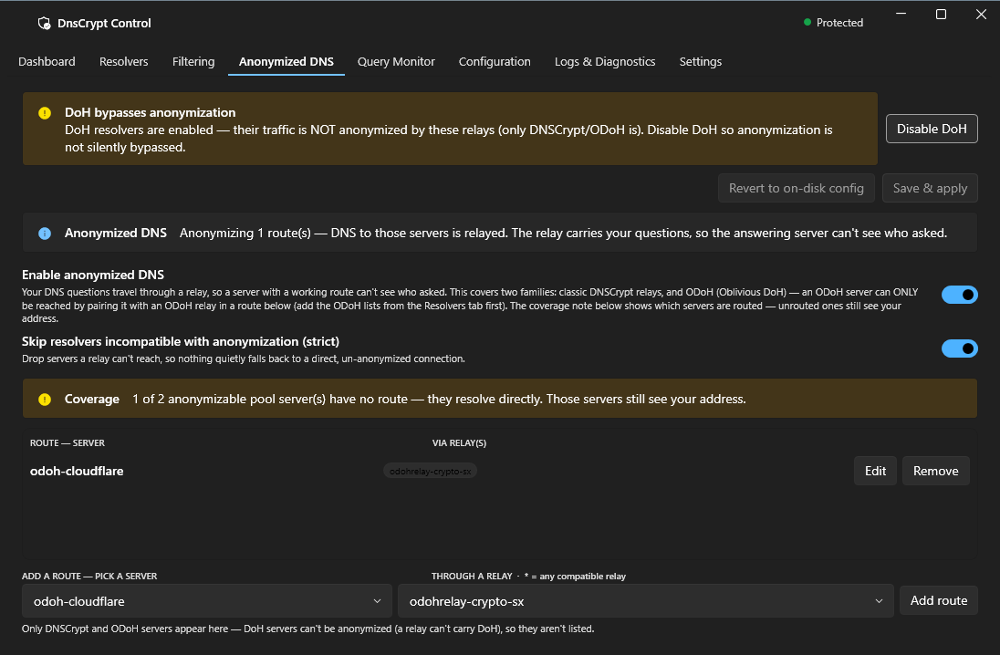

# DnsCryptControl

A Windows desktop app for running **encrypted DNS** through
[dnscrypt-proxy](https://github.com/DNSCrypt/dnscrypt-proxy) — with a real
**kill switch**, DNS-leak protection, anonymized DNS relays, and a clear GUI
for everything dnscrypt-proxy can do.

I’d like to thank everyone involved in the open-source projects I’ve used in the past and will use in the future, as well as everyone who supports these projects. With Claude’s help, I wanted to create a GUI that I could easily use in my daily life, and I’m sharing it with you; I welcome your feedback and criticism.

DnsCryptControl encrypts every DNS lookup your PC makes (DNSCrypt, DoH, or ODoH),
and — when you arm the kill switch — makes sure nothing quietly falls back to
unencrypted DNS if the proxy ever stops. It ships with a sensible, private
default (Quad9 DoH) and works out of the box.



> **Status:** beta. Functionally complete and tested end-to-end, but not yet
> code-signed by a public CA (see [Installing](#installing)).

## Features

- **One-switch protection** — turn encrypted DNS on/off; the dashboard verifies
  there is actually no leak before it shows "Protected".
- **Kill switch (fail-closed)** — blocks plaintext DNS on the standard ports, so
  if the proxy stops, DNS fails closed instead of leaking.
- **DNS-leak mitigations** — disables Windows' Smart Multi-Homed Name Resolution
  and the built-in browser DoH bypass while protected.
- **Resolvers** — browse and pick from the public DNSCrypt / DoH / ODoH lists,
  with protocol and filter facets.
- **Anonymized DNS** — route DNSCrypt or ODoH servers through relays so the
  resolver never sees your IP and the relay never sees your queries.
- **Filtering** — block / allow / cloak / forward rules with live validation.
- **Query monitor & diagnostics** — see live resolution, blocked/cached counts,
  and logs (opt-in, per-session, shredded on exit).
- **System-tray status** — the tray shield turns green when protected, orange if
  a leak is ever detected.

## Three ways to set up your DNS

Every mode is fully encrypted and works behind the kill switch — they differ
only in *how much the resolver learns about you*. All three are verified working
on the current build.

> **📖 Full step-by-step setup guide, with a screenshot for every click:**
> **[docs/SETUP-GUIDE.md](docs/SETUP-GUIDE.md)** — or read it as a web page at
> **[omsintia.github.io/DCC](https://omsintia.github.io/DCC/)**.
> For a settings reference, see [docs/RECOMMENDED-SETTINGS.md](docs/RECOMMENDED-SETTINGS.md).

**1 · Encrypted DNS, direct** *(default)* — a DoH or DNSCrypt resolver used
directly (shipped default: **Quad9 DoH**). Nobody in between can read your
lookups; the resolver you chose sees them. *(Shown above.)*

**2 · Anonymized DNSCrypt** — a DNSCrypt server (here `quad9-dnscrypt`, note the
**DNSCrypt** protocol on port 8443) routed through a **relay**, so no single
party sees both who you are and what you asked.


**3 · ODoH (Oblivious DoH)** — an ODoH target paired with an **ODoH relay**, the
DoH-era version of the same split. Keep one plain DNSCrypt server unrouted in the
pool to bootstrap it.



## Security model

DnsCryptControl is **split-privilege** by design:

- An **unprivileged WPF UI** that you run as a normal user.
- A **LocalSystem helper service** that performs the privileged work — adapter
  DNS pinning, the Windows Firewall kill switch, service control, and config
  writes to a protected directory.
- The two talk over an **authenticated named-pipe** (the helper verifies the
  UI's Authenticode signer, and the UI verifies the helper runs as SYSTEM),
  so an unprivileged process can't drive the privileged one.

Privileged operations are transactional and fail-closed: protection intent is
persisted before anything is applied, so a crash mid-apply re-asserts a safe
state on the next boot rather than leaking, and DNS is only ever restored as
part of a full, ordered teardown.

## Installing

Download the signed `DnsCryptControl-x.y.z.msi` from the
[Releases](../../releases) page and run it. It's a per-machine install that
registers the helper service and imports the app's code-signing certificate.

> **SmartScreen note:** releases are currently signed with a **self-signed**
> certificate, so Windows SmartScreen will show an "unknown publisher" warning
> — choose **More info -> Run anyway**. A public-CA / SignPath signature that
> clears this banner is planned now that the project is open source.

The installer's wizard lets you opt in/out of a desktop shortcut. Once
installed, launch **DnsCryptControl** from the Start menu, flip the main switch,
and you're protected.

## Building from source

Requirements: **.NET 8 SDK** on Windows.

```powershell
# build + run the full test suite
dotnet build DnsCryptControl.sln -c Release
dotnet test  DnsCryptControl.sln -c Debug --filter "Category!=ManualIntegration"

# run the app (UI)
dotnet run --project src/DnsCryptControl.UI
```

Packaging (signed release build + MSI) lives under `tools/`:

```powershell
tools/signing/new-signing-cert.ps1     # one-time: create a local signing cert
tools/packaging/build-package.ps1 -Version 1.0.0
```

See `tools/ci/README.md` for the per-PR and nightly gates (strict 0-warning
build, the full test suite including fuzz smoke + crash replay, and the perf
and soak checks).

## How it works with dnscrypt-proxy

DnsCryptControl doesn't reimplement DNS — it drives a bundled, pinned
`dnscrypt-proxy` binary, generating and validating its TOML config, seeding
signed resolver lists so a fresh install always has a working resolver, and
managing the OS-level plumbing (adapter DNS, firewall, service) around it.

## Acknowledgements

Built on **[dnscrypt-proxy](https://github.com/DNSCrypt/dnscrypt-proxy)** by
Frank Denis and the DNSCrypt project — the encryption engine this app is a
front-end for — and the DNSCrypt public resolver lists. Thanks also to the
authors of WPF-UI, CommunityToolkit.Mvvm, BouncyCastle, and Tomlyn.

## License

[ISC](LICENSE). Third-party components and their notices are listed in
[THIRD-PARTY-NOTICES.md](THIRD-PARTY-NOTICES.md).
