# DnsCryptControl — Setup Guide

**Three ways to set up your DNS — every click shown.**

Each setup below is fully encrypted and works behind the kill switch. They differ
only in *how much the resolver learns about you*. Start with the two‑minute first
run, then pick a setup — every step comes with a real screenshot of the app, and
the **amber ring** marks exactly where to click.

> Prefer this as a designed web page (with the diagrams in your browser's theme)?
> Read the **[online setup guide](https://omsintia.github.io/DCC/)**. This markdown
> version has the same content and renders right here on GitHub.

> **None of these are "plain DNS."** DnsCryptControl only ever speaks encrypted
> DNS — and with the kill switch on, plaintext DNS from anything else on your PC is
> blocked too.

---

## What encrypted DNS does — and doesn't — do

The most important part, so it's up top.

| ✓ It protects your DNS lookups | ✗ It does not hide your traffic |
|---|---|
| Your ISP, network, or public Wi‑Fi can no longer **see or log which domains you look up**. | Your ISP still sees the **IP addresses** you connect to (and can often infer the site from that). |
| DNS‑based **tracking and profiling** is cut off. | Downloads, streams, game sessions and uploads are **not anonymized** by encrypting DNS. |
| DNS‑level **censorship and hijacking** (redirecting you at the resolver) stops working. | **Torrent traffic is not hidden** — your IP is still visible to peers and trackers. |
| You can **block ads and trackers** at the DNS level, for every app at once. | |

> **Need your traffic private, not just your DNS?** That takes a VPN or Tor.
> Encrypted DNS and a VPN solve *different* problems and work well **together**: the
> VPN hides your traffic, and DnsCryptControl makes sure your DNS doesn't quietly
> leak *outside* the tunnel. Think of this app as one solid layer, not the whole stack.

---

## First run — two minutes after installing

*This alone gets you fully encrypted DNS (Setup 1).*

**Open DnsCryptControl from the Start menu** — it opens on the Dashboard. (If no
window appears, it started minimised to the system tray: click the shield icon near
the clock, bottom‑right.) The **kill switch is on by default** (recommended — it's
fail‑closed), so first run is just two clicks:

1. **Turn the main switch On.** This sends your DNS through the encrypted proxy — and
   because the kill switch is already on, nothing can quietly fall back to unprotected
   DNS if the proxy ever stops. The badge turns green *"You're protected"* only after a
   live leak check actually passes — you may briefly see *Verifying…* first. The
   **first time**, Windows recommends a **one‑time reboot** to finish a related leak fix
   (Smart Multi‑Homed Name Resolution) — that reboot comes from enabling protection, and
   your encrypted DNS is already active before you reboot.
2. **Set Browser DoH** (DNS‑over‑HTTPS — the browser's own built‑in encrypted DNS) to
   **blocked**, so Chrome, Edge and Firefox can't quietly bypass the app with it.

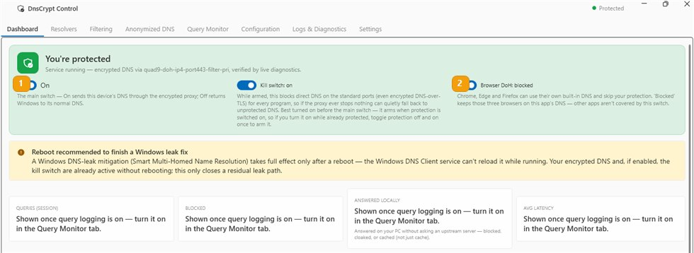

*The numbers on the screenshot match the steps above: **1** main switch · **2** browser DoH. The **kill switch** (middle) is **on by default**.*

---

## Pick your setup

More privacy = a little more setup. All three are shown step by step below.

| Setup | | Privacy | Effort |
|---|---|:---:|---|
| **Setup 1 · Baseline** | Encrypted DNS, direct — a DoH or DNSCrypt resolver, used directly. This is the default (Quad9 DoH); if you did First run, you already have it. | ●●○○ | Easy |
| **Setup 2 · Anonymized** | DNSCrypt through a relay — no single party sees both who you are and what you asked. The sweet spot. | ●●●○ | Moderate (~5 min) |
| **Setup 3 · Oblivious DoH** | ODoH through a relay — the same who/what split, rebuilt on ordinary HTTPS so it blends into normal web traffic. Most moving parts. | ●●●○ | Advanced (~10 min) |

---

## Setup 1 · Encrypted DNS, direct

*Easy · the default*

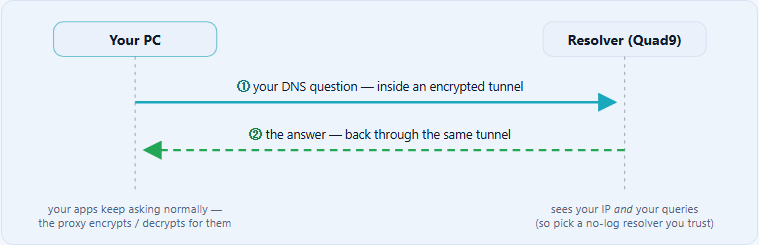

DNS is always a **round trip** — the question goes out and the answer comes back, both
inside the same encrypted connection. Anyone watching the network sees only that your PC
talked to `9.9.9.9` over an encrypted channel — never *what* you asked or what came back.

There are no extra steps: **First run above *is* Setup 1**, using the default
`quad9-doh-ip4-port443-filter-pri`. Prefer a different resolver? Use the moves shown in
Setup 2, steps 1–3 (**Resolvers** tab → search → select → **Use only this server** →
**Save & apply**) and skip the relay part — used directly like this, **any protocol is
fine** (the "must be a DNSCrypt server" note in Setup 2 only applies when you route
through a relay).

---

## Setup 2 · DNSCrypt through a relay

*Moderate · ~5 minutes*

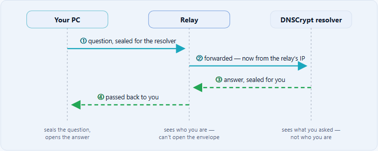

Both directions pass through the relay, and **the relay can read neither**: the question
is encrypted end‑to‑end for the resolver, and the answer is encrypted end‑to‑end for you.
The resolver answers a question that arrives from the relay's address — it never learns
yours. For this to mean anything, the **relay and resolver should be run by different
operators**.

> 🔶 The amber ring in each screenshot marks exactly where to click.

**1. Resolvers tab → search.** Type a DNSCrypt server's name — here
`quad9-dnscrypt-ip4-filter-pri`. It must be a **DNSCrypt** server (or an ODoH one,
Setup 3): plain DoH can't travel through these relays.

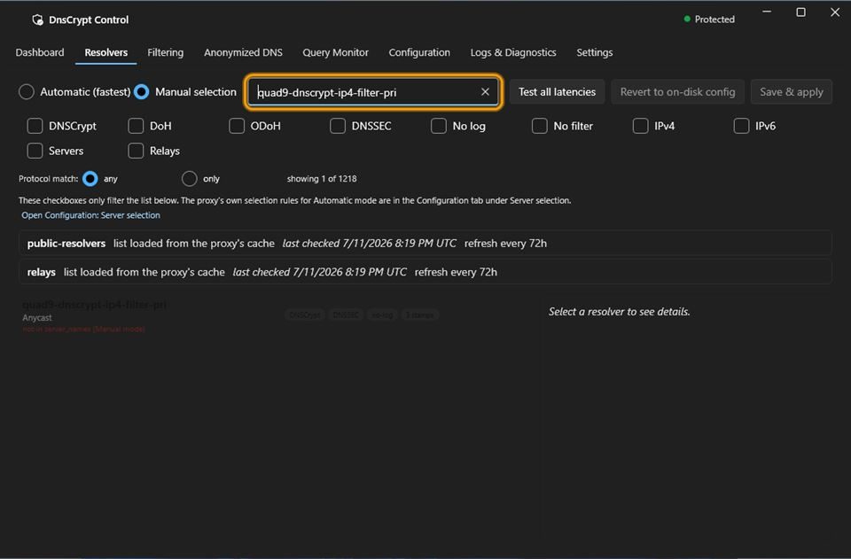

*The search box filters the 800+ public servers as you type.*

**2. Select the server, then click "Use only this server"** in the detail pane on the
right. (Or "Add to pool" if you want to keep your current servers too.)

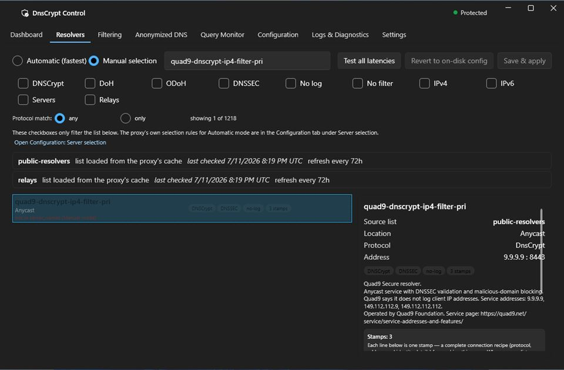

*The detail pane shows the server's protocol, DNSSEC / no‑log properties and address before you commit.*

**3. Click "Save & apply"** (top right). The *"only resolver"* notice is expected — it's
just telling you there's no fallback server.

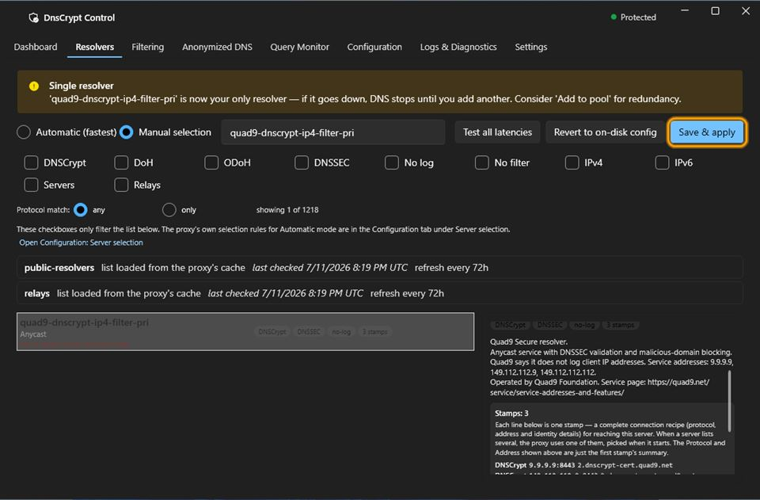

*Every change in the app is staged first and only takes effect at **Save & apply** — and it's rolled back automatically if the proxy rejects it.*

**4. Anonymized DNS tab → the "Add a route" bar at the bottom:** pick your server **(1)**,
pick a relay **(2)**, and click **Add route (3)**. Then **Save & apply** once more. For
real anonymity, prefer a **named relay run by a different company** than your resolver
(the relay name carries its operator); `*` picks any compatible relay but can't guarantee
the operators differ.

> **Route applied but nothing resolves?** A few networks (some VMs, NATs and strict
> firewalls) silently drop the larger UDP packets anonymized DNSCrypt uses — the app shows
> an amber *"DNS not resolving through this route"* notice. Fix it with **Always use TCP**
> (`force_tcp`) in **Configuration → Connection**. Leave it **off** for ODoH (Setup 3),
> where it can break the bootstrap anchor.

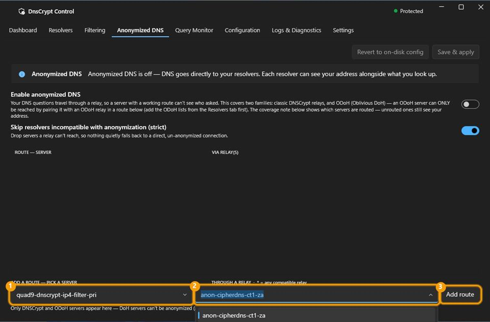

*Only DNSCrypt and ODoH servers appear in the picker — the app won't let you build a route that can't work.*

**5. Check the result.** The **Coverage** bar turns green: every anonymizable server in
your pool now has a route. Use **Edit** / **Remove** on the row to change it later.

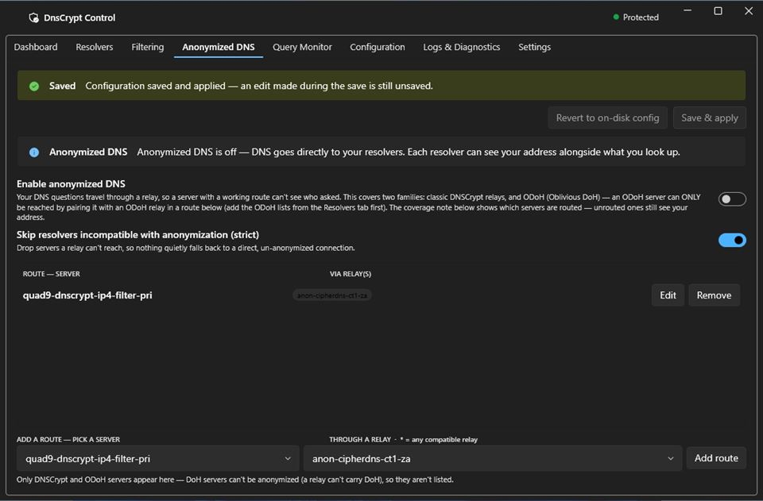

*"Anonymizing 1 route(s)" — DNS to that server is now relayed in both directions.*

**6. Back on the Dashboard**, the active resolver now shows the DNSCrypt server —
verified by a live leak check, reached only through the relay.

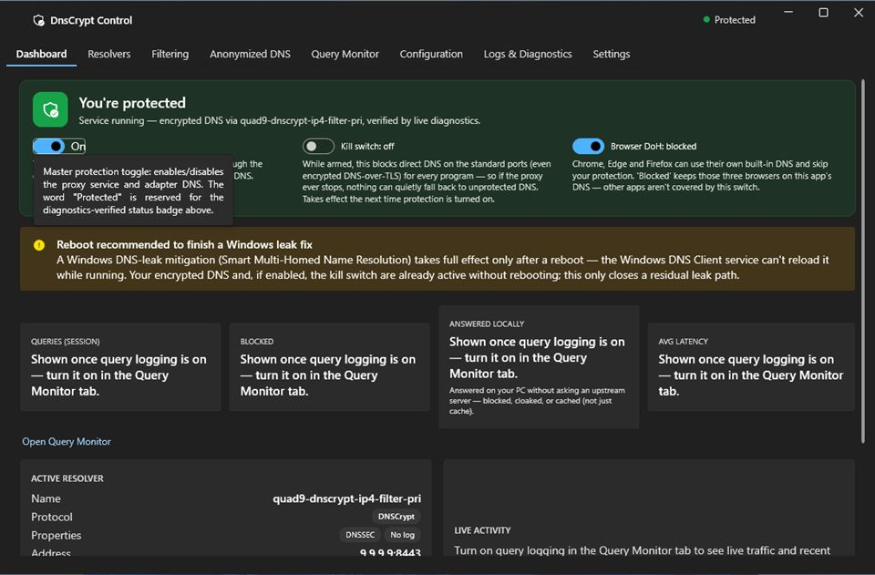

*The Dashboard's Active resolver card shows a **Protocol** row (a **DNSCrypt** badge) and a separate **Address** row (the endpoint, e.g. **9.9.9.9:8443**) — and the relay now sits between you and it.*

---

## Setup 3 · ODoH through a relay

*Advanced · ~10 minutes*

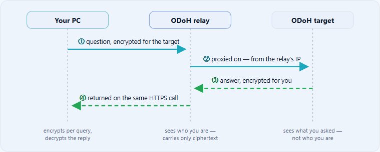

The same who/what split as Setup 2, but the **relayed ODoH queries** ride ordinary HTTPS
(port 443), so they blend in with regular web traffic (the bootstrap anchor's DNSCrypt
traffic on port 8443 doesn't). The round trip happens inside a single HTTPS request: the
relay posts your sealed question to the target and hands you back the sealed answer. As
with Setup 2, this only holds if the **relay and target are run by different operators**.
One plain DNSCrypt server stays **unrouted** in your pool as the **bootstrap anchor** —
the proxy uses it (over the app's own local connection, which the kill switch deliberately
leaves open) to fetch and refresh the ODoH server/relay lists.

> 🔶 The amber ring in each screenshot marks exactly where to click.

**1. Resolvers tab → tick the ODoH filter.** This shows only ODoH‑capable entries.

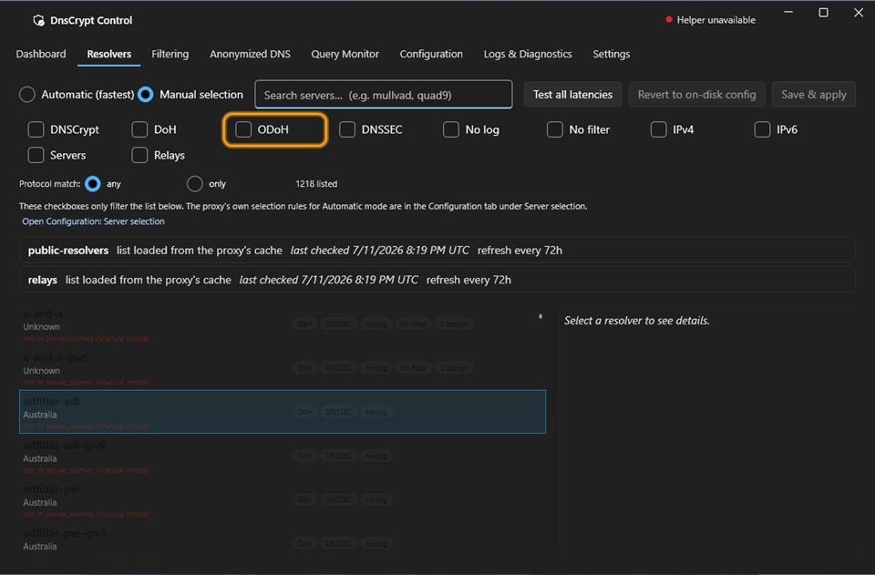

*The protocol checkboxes only filter the list — they don't change your config.*

**2. First time, the list is empty — click "Add ODoH server lists".** ODoH servers live
in two extra lists that aren't configured out of the box.

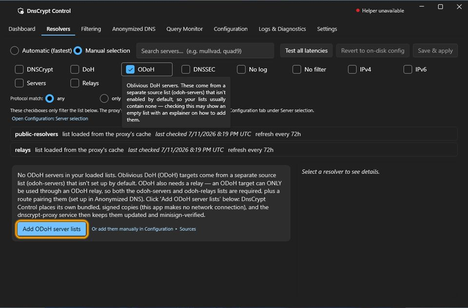

*The empty state explains why the list is empty instead of leaving you guessing.*

**3. Confirm with "Add lists".** The dialog shows the two official DNSCrypt‑project URLs.
The app itself makes **no network connection** — it places its own bundled,
signature‑verified copies, and the dnscrypt‑proxy service keeps them updated from the
official source.

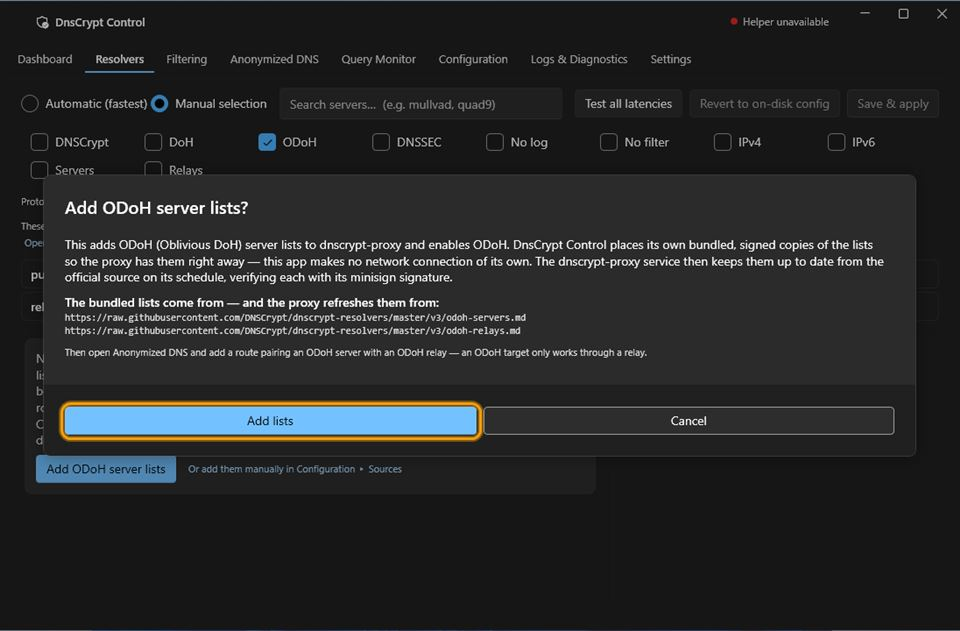

*Everything the proxy downloads is verified against the DNSCrypt project's minisign signature.*

**4. Search `odoh-cloudflare` → select it → "Add to pool" → Save & apply.**

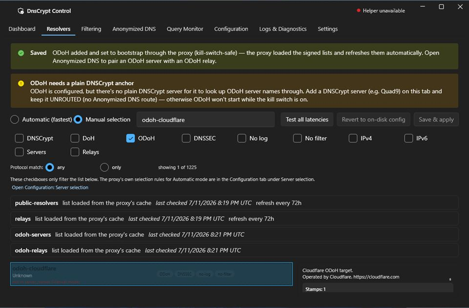

*Add — don't "use only": the pool must also keep one plain DNSCrypt server (the bootstrap anchor, see below).*

> **Keep one plain DNSCrypt server in the pool, unrouted.** An ODoH target can't
> bootstrap itself — the proxy needs a working resolver to fetch the relay/target lists.
> - **From Setup 2** (a DNSCrypt server already routed): just **Remove** its route on the Anonymized DNS tab so it becomes the anchor.
> - **From First run / Setup 1** (only a DoH server): a DoH server can't be the anchor — first add a plain DNSCrypt server with Setup 2 steps 1–2, but click **Add to pool** (not "Use only") and give it no route.

**5. Anonymized DNS tab:** pick `odoh-cloudflare` **(1)**, pick an `odohrelay-*` relay
**(2)**, click **Add route (3)**, then **Save & apply**. An ODoH target **only** works
through a relay — without a route it simply stays unused.

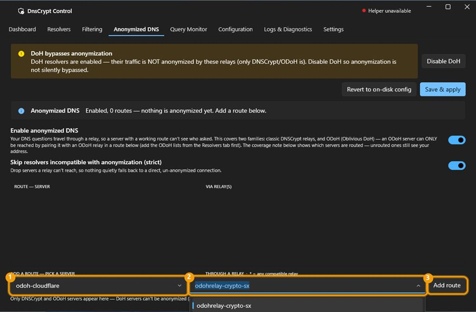

*The relay picker only offers relays whose protocol matches the server — a mismatched pair can't be built.*

**6. Check the result.** The route row shows `odoh-cloudflare` via your relay. The amber
coverage note about one server having no route is **expected** — that's your bootstrap
anchor resolving directly, by design.

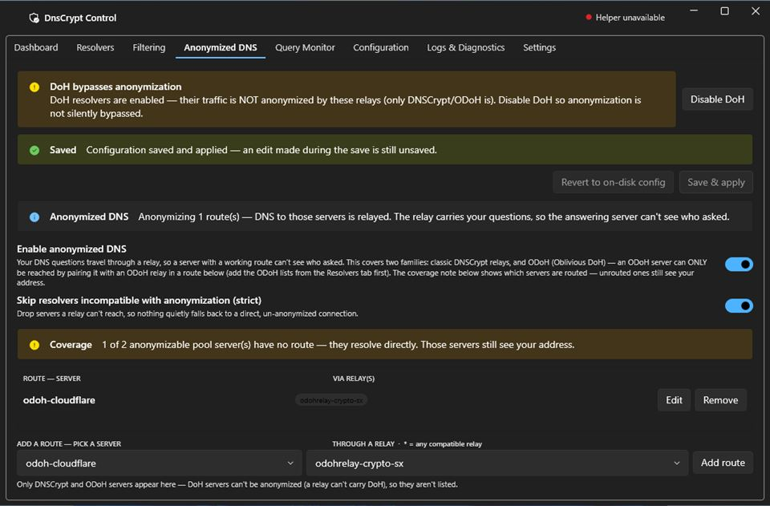

*The app tells you honestly which servers are routed and which resolve directly.*

**7. Dashboard: protected.** The proxy's own log confirms the ODoH target came up
(`OK (ODoH)` in Logs & Diagnostics), verified by the same live leak check as every other
setup.

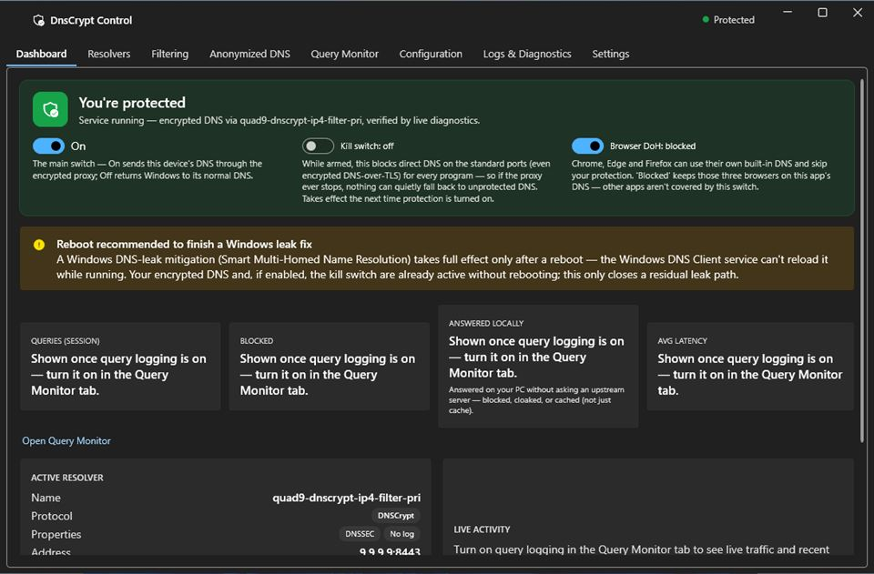

*Verified by the same live leak check as every other setup.*

> **Honest note on privacy.** Day to day the proxy load‑balances across your pool, and it
> tends to favour the faster *direct* anchor over the slower relayed ODoH path — so a share
> of everyday queries is answered directly by the anchor, which sees both your IP and your
> question. So Setup 3 is **not strictly more private than Setup 2** as configured — choose
> it for the HTTPS transport (traffic blending), not for extra anonymity. If you want
> *every* query relayed, Setup 2 is the stronger choice.

---

## Optional: block ads, trackers & malware

*Layers on top of any setup above.*

In the **Filtering** tab, paste a community blocklist into **Blocked names** and **Save** —
one domain pattern per line, in the **wildcard‑domains** format shown below. These are the
widely used, community‑maintained lists the DNSCrypt project points to:

| List | What it is | Source |
|---|---|---|
| **DNSCrypt official blocklist** | The project's own aggregate of ads, trackers & malware. | [download.dnscrypt.info/blacklists/domains/](https://download.dnscrypt.info/blacklists/domains/) |
| **HaGeZi DNS Blocklists** | Popular, tiered (light → ultimate). Use the wildcard format. | [github.com/hagezi/dns-blocklists](https://github.com/hagezi/dns-blocklists) |
| **OISD** | Set‑and‑forget, tuned to avoid false positives. | [oisd.nl](https://oisd.nl) |
| **Steven Black's hosts** | Classic consolidated list — **hosts format**: strip the leading `0.0.0.0` off each line before pasting (raw hosts lines are silently ignored by Blocked Names). | [github.com/StevenBlack/hosts](https://github.com/StevenBlack/hosts) |
| **Firebog** | A curated "list of lists" — mostly hosts/adblock format, so convert to domains‑only before pasting. | [firebog.net](https://firebog.net) |
| **WindowsSpyBlocker** | Blocks Windows telemetry — has a dnscrypt‑ready set. | [github.com/crazy-max/WindowsSpyBlocker · data/dnscrypt](https://github.com/crazy-max/WindowsSpyBlocker/tree/master/data/dnscrypt) |

**Pattern format:** `example.com` · `=exact.com` · `*keyword*` · `ads.*`

**Blocking IPs?** The DNSCrypt project recommends name‑based blocking; **Blocked IPs** is
only for the rare case you want to null specific resolved addresses.

Reference: the
[DNSCrypt Public‑blocklist wiki](https://github.com/DNSCrypt/dnscrypt-proxy/wiki/Public-blocklist)
and [Cloaking wiki](https://github.com/DNSCrypt/dnscrypt-proxy/wiki/Cloaking).

---

## Tuning by goal

The handful of settings actually worth touching — everything else already ships with good defaults.

### 🔒 Maximum privacy

| Setting | Recommendation | Why |
|---|---|---|
| `require_nolog` | On (default) | Only use resolvers that declare they keep no logs. |
| Browser DoH | Blocked | Stops Chrome, Edge and Firefox using their own DNS‑over‑HTTPS to bypass the app. |
| Kill switch | On | No silent fallback to unprotected DNS if the proxy ever stops. |
| Anonymized DNS | On + a route | Your query travels through a relay, so no single party sees both who you are and what you asked (Setup 2). |
| ODoH | Optional | The DoH‑era version of the same split, carried on ordinary HTTPS (Setup 3). |

### ⚡ Speed & comfort

| Setting | Recommendation | Why |
|---|---|---|
| `cache` | On (default) | Repeated lookups are answered instantly from memory. |
| `lb_estimator` | On (default) | Keeps re‑measuring server speed so you stay on the fastest one. |
| `require_dnssec` | On (our default) | Every answer is cryptographically validated and forged replies are rejected. It trims the usable pool a little — turn it off if you'd rather keep the widest, fastest set of servers. |
| `block_ipv6` | On *if no IPv6* | Skips slow AAAA lookups that would time out. Leave off if you actually use IPv6. |

### 🧹 Filtering

| Setting | Recommendation | Why |
|---|---|---|
| Blocked names | Enable one | Blocks ad/tracker domains for every app at once — use one of the community lists above. |
| `block_undelegated` | On (default) | Names that can't exist publicly (e.g. `.local`) never leak out. Safe. |
| `block_unqualified` | On (default) | Bare device names (e.g. `printer`) stop leaking to the internet. Safe. |

> **For torrenting / streaming / gaming:** encrypted DNS helps (your ISP can't log the
> trackers, mirrors and CDNs you resolve), but your **traffic itself isn't hidden** — run a
> **VPN alongside** this app, and keep the kill switch on so a mid‑download hiccup can't
> silently drop you back onto your ISP's DNS.

---

## Leave the rest alone — and how to confirm it's working

Most of the ~118 settings in the **Configuration** tab are internal `dnscrypt-proxy` knobs
(timeouts, TLS options, cache sizes) that already ship with good defaults. A small
**"(default)"** marker sits next to any setting you haven't changed — if it says
*(default)*, the proxy is already using its recommended value. Don't tweak these without a
specific reason.

**How to confirm it's working**

- **Dashboard** shows the green **"You're protected"** headline — which appears only after a live leak check passes, not just because the switch is on.
- **Query Monitor** (opt‑in — it's your browsing history) shows your lookups live: PASS, REJECT, CLOAK, SYNTH.
- **Kill‑switch test:** with it armed, a plaintext query to a public server (e.g. `8.8.8.8`) is blocked, while normal browsing keeps working through the proxy.

**Good to know**

- DnsCryptControl makes **zero outbound connections of its own** — no update checks, no telemetry — enforced at build time.
- It drives the bundled `dnscrypt-proxy`, which fetches and cryptographically verifies its own server lists.
- On a restrictive network (some VMs / NATs), if an anonymized route won't resolve, turn on **Always use TCP** (`force_tcp`) in Configuration → Connection.

---

*All setups keep the **kill switch on** — if the proxy stops, DNS fails closed, it never
leaks. Built on [dnscrypt-proxy](https://github.com/DNSCrypt/dnscrypt-proxy).*
